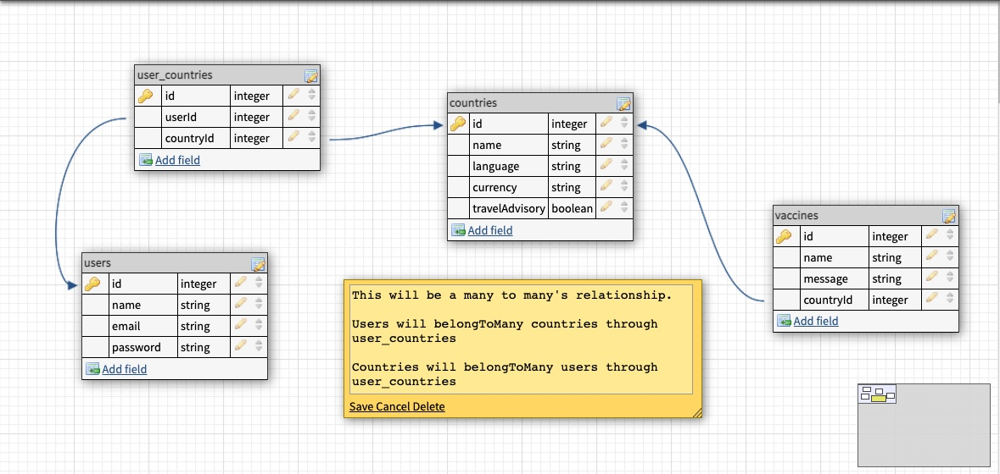

# Well Informed Traveller

### Summary:
For this app you will be able to pull up travel related information for countries the user is interested in travelling to. They will able to save any countries they like in order to have easy access to them. This app will make it easier to find a lot of the information you need to make well informed travel desecions.

### User Stories:
* When the user loads the screen they will have the option to log-in or sign up if they don't already have an account
* When the user chooses to sign in they will go to their profile page
* When the user decides to sign-up they will be taken to the sign-up form
* When the user submits their form they will be taken to their profile
* If the user is in their profile they either select search for more countries, look at any saved countries or log-out
* If the user clicks on the search for more countries button they will be taken to the search screen
* In the search screen the user can search by country and the countries info will show up below
* Their will be a nav bar after log-in that will allow the user to toggle between home, profile and search screens.

# MVP's
1. User can log into profile
1. Non-users can sign-up to have an account
1. The user can log-out of the account
1. User can navigate between profile, home and search
1. The user can save their favorite countries
1. When the user is on their profile they can see all saved countries
1. Be able to search for country with name
1. When search happens country shows up on screen

# Wireframes
#### Homepage/Sign-in screen

#### Sign-up screen

#### Profile Screen

#### Country Search Screen

# ERD

# Routes Inventory
VERB | PATH | SUMMARY
-----|----------|----------------
POST | /user | create new user
POST | user/login | allows user to log in
GET | user/saved-countries | pulls saved country & shows on profile screen
GET | /:{countryName} | grabs single country from api
POST | /country/countryId | adds country to user profile

# Stretch Goals:
* allow user to search by more than just by country name(may have to check to see if possible with API)
* Catergorize their saved searches by region, language etc..
* Any and all styling beyond clarity and user functionabilty
##### The below will be upgraded search options
* Allow them to look up currency comparison
* Allow them look up weather at times of year
